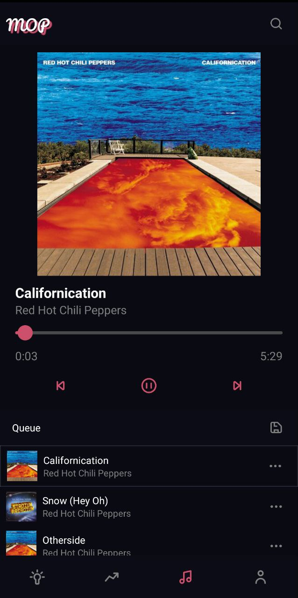

<div align="center">
  <h1>MopMobile</h1>
  
  <p>
    An awesome deezer client !
  </p>
<!-- Badges -->
<p>
  <a href="https://appcenter.ms">
    
  </a>
</p>
   
<h4>
    <a href="https://github.com/MalauD/MopMobile/issues/">Report Bug</a>
  <span> · </span>
    <a href="https://github.com/MalauD/MopMobile/issues/">Request Feature</a>
  </h4>
</div>
<div align="center">

  
</div>
<br />
<!-- About the Project -->

## About the Project

This is the mobile client of the app [MopRs](https://github.com/MalauD/MopRs). Most of the features from the web app is included.

## How to build ?

This is a react native project so in order to build you need to have the requirements specified on the [React Native requirements page](https://reactnative.dev/docs/environment-setup).
Then you can run the following commands :

```bash
npm install
npx react-native run-android
```

<!-- Contributing -->

## Contributing

<a href="https://github.com/MalauD/MopMobile/graphs/contributors">
  
</a>

Contributions are always welcome!

Do not hesitate to start a pull request !

<!-- Code of Conduct -->

### Code of Conduct

Please read the [Code of Conduct](https://github.com/MalauD/MopRs/blob/master/CODE_OF_CONDUCT.md)

<!-- License -->

## License

Distributed under the no License. See [LICENSE](https://github.com/MalauD/MopRs/blob/master/LICENSE) for more information.
